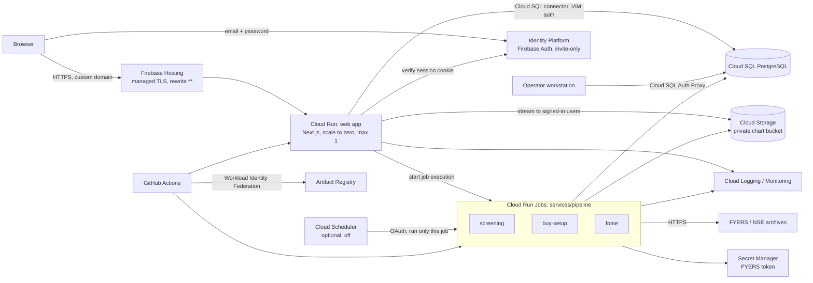

# Google Cloud architecture

The application runs entirely on Google Cloud. Supabase and Netlify are no longer runtime dependencies, and **no data is migrated from them**: the QA environment starts from an
empty database (the migrations plus a small documented seed) and is populated by fresh NSE/FYERS pipeline runs and by invitations.

## Repository layout

| Path | What it is |
|---|---|
| `app/` | Next.js web app (Cloud Run service). `app/Dockerfile` |
| `services/pipeline/` | Node batch code run as Cloud Run Jobs, and the system seed. `services/pipeline/Dockerfile` |
| `db/` | Versioned SQL migrations `0001`–`0021` (the schema's source of truth, [schema-provenance.md](schema-provenance.md)), migration runner, pgTAP-style SQL tests, clean-database smoke test |
| `infra/terraform/` | Infrastructure as code (validated, **not applied**) |
| `hosting/`, `scripts/render-firebase-config.mjs` | Firebase Hosting config template and renderer (Terraform is authoritative) |
| `scripts/qa-smoke.mjs` | Black-box smoke test for any running deployment |
| `.github/workflows/` | CI and deploy (Workload Identity Federation, no stored credentials) |
| `docker-compose.yml`, `firebase.json` | Local PostgreSQL, Cloud Storage emulator, Auth emulator |

## Component mapping

| Before | Now |
|---|---|
| Netlify (Next.js) | Cloud Run service behind Firebase Hosting |
| Supabase Edge Functions (Deno) | Cloud Run Jobs (Node): `screening`, `buy-setup`, `fome` |
| `pg_cron` + `pg_net` + Vault + self-chaining | one long-running Job execution (Cloud Scheduler optional, off) |
| Supabase Postgres + RLS | Cloud SQL PostgreSQL + explicit server-side authorization ([authorization.md](authorization.md)) |
| Supabase Auth | Identity Platform (Firebase Auth), invite-only ([authentication.md](authentication.md)) |
| Supabase Storage `direction-charts` | Empty private Cloud Storage bucket, served through an authenticated route |
| Function secrets | Secret Manager |

## Removed features

The **Buy Signals**, **Sell Signals** and **Backtests** pages were removed together with everything used only by them:
the three pages, `app/src/lib/data/signals.ts`, and their navigation links. `Backtests` was a placeholder with no backing tables or code.

**Kept on purpose, with evidence** (so this is a reviewed decision, not an omission):

- The `BSP-*` and `SSP-*` *rules* and the playbook YAMLs (`strategies/buy-signal-playbook.yaml`, `strategies/sell-signal-playbook.yaml`) are **not** exclusive to those pages.
  - **Buy Setup Analysis depends on `BSP-M1` and `BSP-M3`.** They are produced by the screening pipeline from the buy playbook and read by the `buy_setup_analysis_ledger` view (`db/migrations/0011`, `0014`), the buy-setup job (`loadTimeframeGateResults`) and `app/src/lib/data/buy-setup-analysis.ts`.
  - **All playbook rules feed tier classification.** `services/pipeline/src/run-screening/rank.js` `classify()` pools `MANUAL_REVIEW` traces from *every* evaluated rule, so removing the `SSP-*` (or the other `BSP-*`) sentinel rules would silently change the tiers shown on the retained Dashboard and Stock ledger.
  - Deleting them requires a deliberate strategy change (`rule_version` bump per `AGENTS.md` Change Control), not a feature removal.
- The swing **Analysis** pages (`/analysis/bullish|bearish`) use `buy-swing.yaml` / `sell-swing.yaml`, a different feature.
- `AGENTS.md` rules about validating strategies by backtesting are research-methodology rules and are unchanged.

## More

- [runbooks/qa-deployment.md](runbooks/qa-deployment.md): the QA procedure (DNS, migrations, seed, checks, teardown)
- [schema-provenance.md](schema-provenance.md), [seed-data.md](seed-data.md)
- [authentication.md](authentication.md), [authorization.md](authorization.md)
- [environment-variables.md](environment-variables.md), [local-development.md](local-development.md)
- [deployment.md](deployment.md), [iam-proposal.md](iam-proposal.md), [cost-and-sizing.md](cost-and-sizing.md)
- [shared-strategy-dependencies.md](shared-strategy-dependencies.md): why `BSP-*`/`SSP-*` are retained
- [deployment-readiness.md](deployment-readiness.md): verification results and go/no-go
- Runbooks: [security](runbooks/security.md), [FYERS token](runbooks/fyers-token.md), [rollback](runbooks/rollback.md), [operations](runbooks/operations.md), [users](runbooks/user-management.md)
