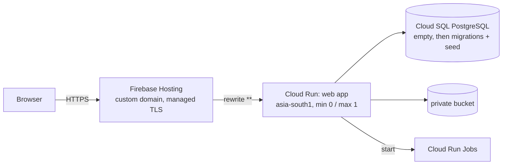

# Runbook: QA deployment (`https://hrtstocksqa.manaoorugpt.com`)

> **Nothing has been deployed.** Phase 3 starts only after the owner sends the exact phrase `APPROVE QA DEPLOYMENT`.
> No live data from any earlier system is migrated: QA starts from an empty database and is filled by fresh pipeline runs and invitations.



No load balancer and no Cloud Run domain mapping exist. Only the host `hrtstocksqa.manaoorugpt.com` is involved; the apex and every other
`manaoorugpt.com` subdomain are untouched.

## 0. Prerequisites (operator)

- `gcloud auth login` and `gcloud auth application-default login` (Application Default Credentials; no key files anywhere).
- The operator already holds the administrative access needed to run Terraform in the project ([../iam-proposal.md](../iam-proposal.md)); this repository grants the operator nothing.
- The project is already linked to a billing account (Identity Platform, Cloud SQL and Firebase Hosting rewrites to Cloud Run need it). This repository never links, unlinks or changes billing.
- `infra/terraform/terraform.tfvars` (git-ignored; the committed template is `terraform.tfvars.example`).

## 1. Plan and apply infrastructure

```bash
cd infra/terraform
terraform init
terraform plan -out qa.tfplan       # review: only creations, nothing destroyed
terraform apply qa.tfplan
terraform output dns_records_required
```

The plan fails early if `gcp_project_number` does not match the project. **Nothing is applied without the approval phrase.**

## 2. DNS (the only manual external step)

The DNS provider for `manaoorugpt.com` is not known to this repository, so Terraform never touches DNS. After `apply`, take the records from:

```bash
terraform output dns_records_required     # host, type, value, action
terraform output custom_domain_state
```

Add **exactly** those records, only for the host `hrtstocksqa` (typically an `A`/`AAAA` pair or a `CNAME`, plus a `TXT` ownership record; Hosting states which).
Do not change any other record. Then wait: ownership verification and the managed certificate can take from minutes to a few hours.
Re-run `terraform output custom_domain_state` (or `terraform apply`, which refreshes it) until it reports connected/active, then verify:

```bash
node scripts/qa-smoke.mjs --base-url https://hrtstocksqa.manaoorugpt.com --expect-migrations 21 --check-http
```

Before DNS is ready, test through the Firebase-generated URL (`terraform output hosting_default_url`, `https://<site>.web.app`); the smoke command accepts it as `--base-url`.
Sign-in works there too (it is an authorized domain and an allowed origin); the raw `run.app` URL is intentionally neither.

## 3. Database: migrations and system seed (operator, from a checkout)

Schema changes are applied by the operator, never by CI or by a runtime identity. The Cloud SQL Auth Proxy connects through your own credentials.

```bash
# a) set the built-in postgres user's password out of band (it is never in Terraform, state or the repository)
gcloud sql users set-password postgres --instance hrtstocks-qa-pg --prompt-for-password

# b) start the proxy in another terminal
cloud-sql-proxy "$(terraform output -raw cloud_sql_connection_name)" --port 5433

# c) migrate, grant the runtime roles, seed (one connection string; do not put the password in shell history: use PGPASSWORD or a prompt)
export DATABASE_URL='postgres://postgres:<password>@127.0.0.1:5433/hrtstocks'
export GRANT_ROLES="$(terraform output -raw grant_roles)"
npm run db:status                    # 21 pending on a new database
npm run db:migrate                   # applies 0001..0021 and grants app_web / app_pipeline
npm run db:migrate                   # second run: "Database is up to date."
npm run seed:system                  # documented, idempotent (seed-data.md); repeat is harmless
```

`db/migrate.mjs` checksums applied files and takes an advisory lock. The app reports readiness at `/api/health/ready` (`migrationsApplied`).

## 4. Secrets: FYERS

Terraform only creates empty secret containers. Add the values out of band ([fyers-token.md](fyers-token.md)); never print or commit them.
The FYERS app's redirect URI (configured on the FYERS side by the owner; this repository does **not** modify the external app) must be exactly:

```
https://hrtstocksqa.manaoorugpt.com/fyers/callback
```

## 5. Deploy code

Configure the GitHub repository variables from `terraform output` (`GCP_PROJECT_ID`, `GCP_REGION`, `GCP_WORKLOAD_IDENTITY_PROVIDER`, `GCP_DEPLOYER_SERVICE_ACCOUNT`,
`ARTIFACT_REPOSITORY`, `NAME_PREFIX`, `FIREBASE_API_KEY`, `FIREBASE_AUTH_DOMAIN`) and a `qa` environment that requires a reviewer, then run the *Deploy* workflow.
It builds both images, updates the three jobs and deploys the web service. It has no database access.
(`github_repository` must be set in `terraform.tfvars` first, or the Workload Identity pool is not created.)

## 6. First administrator (only when an address is supplied)

Until an administrator e-mail is supplied, **no user exists and none is created or invited**. When supplied:

```bash
BOOTSTRAP_ADMIN_EMAIL=<address> npm run seed:system                      # authorizes the address
cd app && node scripts/invite-user.ts --email <address> --role system_admin --reset-link   # creates the Identity Platform account; prints a one-time link for you to deliver
```

The person sets a password with the link, signs in, verifies their e-mail, and is linked to a `system_admin` profile. No e-mail is sent by the tooling.

## 7. QA verification checklist

| Check | How |
|---|---|
| Health, readiness, headers, auth enforcement, removed routes, FYERS landing page, HTTP→HTTPS | `node scripts/qa-smoke.mjs --base-url https://hrtstocksqa.manaoorugpt.com --expect-migrations 21 --check-http` |
| Empty-state UI | sign in as the administrator: dashboard/ledger show "no published run", no errors |
| Session cookie is secure, HTTP-only, host-only | browser dev tools after signing in: `__session` has `Secure`, `HttpOnly`, no `Domain` attribute, `SameSite=Lax` |
| First ingestion + first screening run + published snapshot | rotate the FYERS token, **Run screening now**; execution succeeds, one `published` run appears, charts render |
| First upload / download | after that run, `stored_objects` has rows and a chart loads in the UI; the bucket object exists (`gcloud storage ls gs://<bucket>/`) |
| Unauthorized access | signed out: `/api/charts/...` returns 401; signed-in `viewer`: staff routes are refused; direct bucket URL returns 403 |
| Failed ingestion publishes nothing | (optional) run with an invalid token: the run fails with the FYERS message and no snapshot is published |

## 8. Teardown

```bash
# The Cloud SQL instance and the bucket are protected against accidental deletion.
# 1. set cloud_sql_deletion_protection = false in terraform.tfvars and apply
# 2. empty the bucket:  gcloud storage rm -r gs://<bucket>/**
# 3. terraform destroy
# 4. remove the hrtstocksqa DNS records at the DNS provider
```

Identity Platform configuration is not deleted by `terraform destroy` (it is removed from state only); disable sign-in in the console if the project is kept.

## 9. Rollback

See [rollback.md](rollback.md). The database is disposable in QA: the recovery for a bad schema is a new corrective migration or, since no data needs preserving, recreating the database.
